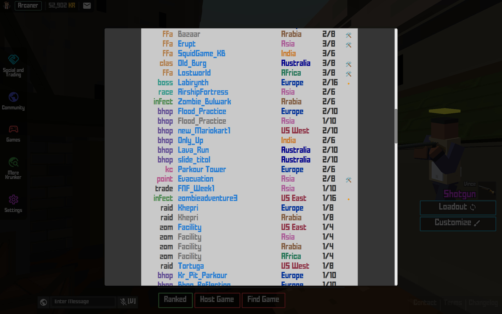

# KUserscripts

Krunker.io userscripts for a smooth, distraction free experience.

## Click to install

Your browser needs a userscript manager extension, such as Violentmonkey ([Chrome/Brave](https://chrome.google.com/webstore/detail/violentmonkey/jinjaccalgkegednnccohejagnlnfdag), [Firefox](https://addons.mozilla.org/en-US/firefox/addon/violentmonkey/)).

- [clean_ui](https://github.com/Infinitifall/KUserscripts/raw/main/scripts/clean_ui.user.js) or [clean_ui_aggressive](https://github.com/Infinitifall/KUserscripts/raw/main/scripts/clean_ui_aggressive.user.js)
  - Cleans up the UI
  - `clean_ui` won't clash with custom css from maps and mods
  - `clean_ui_aggressive` will override all custom css
- [add_kbrowser](https://github.com/Infinitifall/KUserscripts/raw/main/scripts/add_kbrowser.user.js)
  - Replaces server browser with KBrowser
- [no_extra_click](https://github.com/Infinitifall/KUserscripts/raw/main/scripts/no_extra_click.user.js)
  - Gets rid of extra click needed to open server browser

## Screenshots

