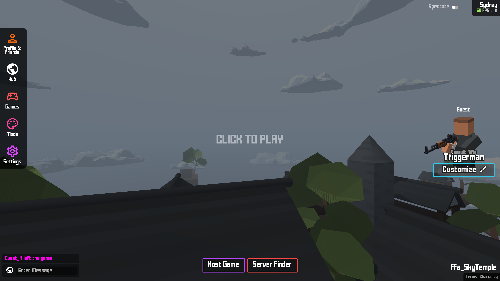
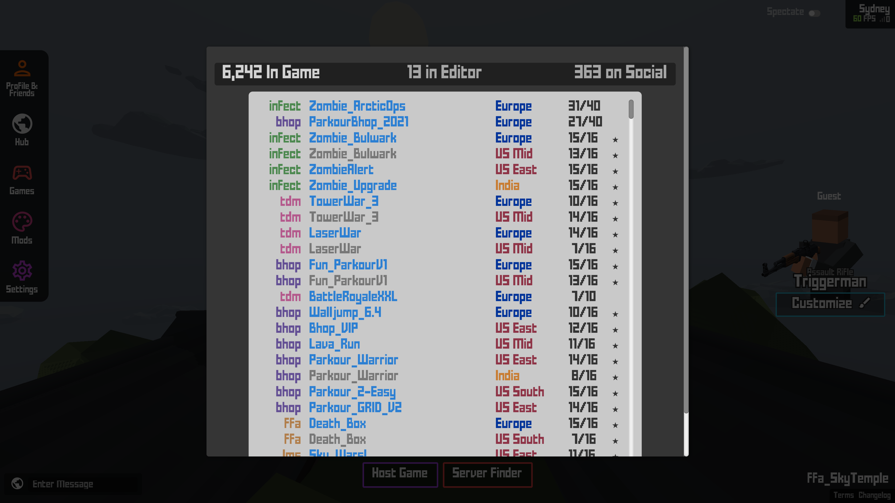

# KUserscripts

Userscripts are a small programs which run in your web browser (usually via an extension) and make changes to websites you visit - for example, changing their look or adding extra features.

## Installation

1. Install a userscript manager such as `Violentmonkey`, `Greasemonkey` or `Tampermonkey`

    - [Install Violentmonkey for Google Chrome, Chromium or Brave Browser](https://chrome.google.com/webstore/detail/violentmonkey/jinjaccalgkegednnccohejagnlnfdag)
    - [Install Violentmonkey for Firefox](https://addons.mozilla.org/en-US/firefox/addon/violentmonkey/)
    - [Install Violentmonkey for Microsoft Edge](https://microsoftedge.microsoft.com/addons/detail/violentmonkey/eeagobfjdenkkddmbclomhiblgggliao)

2. Install [clean_ui](https://github.com/Infinitifall/KUserscripts/raw/main/scripts/clean_ui.user.js) or [clean_ui_aggressive](https://github.com/Infinitifall/KUserscripts/raw/main/scripts/clean_ui_aggressive.user.js)
    
    - `clean_ui` will disable itself if a map or a mod loads a custom css (no interference)
    - `clean_ui_aggressive` will override custom css from maps and mods

    Clean interface, only displaying the essential elements

    <figure>
        
    </figure>

3. Install [add_kbrowser](https://github.com/Infinitifall/KUserscripts/raw/main/scripts/add_kbrowser.user.js)

    Replaces the default server browser with an embed KBrowser

    <figure>
        
    </figure>

4. Install [no_extra_click](https://github.com/Infinitifall/KUserscripts/raw/main/scripts/no_extra_click.user.js)

    Removes the popup when opening the server browser, instead directly opens it
