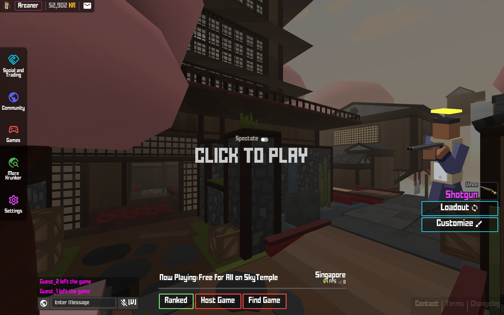

# KUserscripts

Krunker.io userscripts for a smooth, distraction free experience.

Your browser needs a userscript manager extension, such as Violentmonkey ([Chrome/Brave](https://chrome.google.com/webstore/detail/violentmonkey/jinjaccalgkegednnccohejagnlnfdag), [Firefox](https://addons.mozilla.org/en-US/firefox/addon/violentmonkey/)).

## Click to install [clean_ui](https://github.com/Infinitifall/KUserscripts/raw/main/scripts/clean_ui.user.js) or [clean_ui_aggressive](https://github.com/Infinitifall/KUserscripts/raw/main/scripts/clean_ui_aggressive.user.js)

Gives you a simple clean interface while keeping all the important elements visible.

- `clean_ui` will disable itself if a map or a mod loads a custom css (no clashing)
- `clean_ui_aggressive` will override all custom css from maps and mods

## Click to install [add_kbrowser](https://github.com/Infinitifall/KUserscripts/raw/main/scripts/add_kbrowser.user.js)

Replaces the default server browser with an embedded KBrowser, which focuses on custom games.

## Click to install [no_extra_click](https://github.com/Infinitifall/KUserscripts/raw/main/scripts/no_extra_click.user.js)

Gets rid of the extraneous chooser popup when clicking on the server finder, instead directly opens it.

## Click to install [no_twitch](https://github.com/Infinitifall/KUserscripts/raw/main/scripts/no_twitch.user.js)

Removes the Twitch embed from the social hub, saving performance. To save bandwidth you'll need to install a [request blocker](https://addons.mozilla.org/en-US/firefox/addon/request-blocker-we/) and block Twitch domains.

## Click to install [clean_ui_social](https://github.com/Infinitifall/KUserscripts/raw/main/scripts/clean_ui_social.user.js)

Removes clutter from social hub.

